# Clean Architecture Katmanları

```mermaid
graph TB
    subgraph Presentation["🎯 PRESENTATION LAYER<br/>(Blog.API - Controllers)"]
        API[REST API Endpoints]
        JWT[JWT Authentication]
        Exception[Global Exception Handling]
        CORS[CORS Configuration]
        Rate[Rate Limiting]
        Swagger[Swagger/OpenAPI]
    end
    
    subgraph Application["⚙️ APPLICATION LAYER<br/>(Blog.Application - Use Cases)"]
        Business[Business Logic]
        DTO[DTOs]
        Interfaces[Interfaces<br/>IRepository, IService]
        Validation[Validation Rules]
        Mapper[AutoMapper Profiles]
    end
    
    subgraph Infrastructure["🔧 INFRASTRUCTURE LAYER<br/>(Blog.Infrastructure)"]
        DbContext[Database Context<br/>EF Core]
        Repo[Repository Pattern<br/>Implementation]
        External[External Services<br/>Email, Elasticsearch, RabbitMQ]
        SignalR[SignalR Hubs]
        TokenService[JWT Token Service]
        Consumers[Message Consumers]
    end
    
    subgraph Domain["💎 DOMAIN LAYER<br/>(Blog.Domain - Core)"]
        Entities[Entities<br/>User, Post, Comment]
        Enums[Enums<br/>PostStatus, NotificationType]
        Events[Domain Events]
        Rules[Business Rules]
        ValueObjects[Value Objects]
    end
    
    %% Dependencies
    Presentation --> Application
    Application --> Infrastructure
    Infrastructure --> Domain
    
    %% Styling
    classDef presentationStyle fill:#4A90E2,stroke:#2E5C8A,stroke-width:3px,color:#fff
    classDef applicationStyle fill:#7ED321,stroke:#5A9B18,stroke-width:3px,color:#fff
    classDef infrastructureStyle fill:#F5A623,stroke:#B87A1A,stroke-width:3px,color:#fff
    classDef domainStyle fill:#D0021B,stroke:#9A0115,stroke-width:3px,color:#fff
    
    class Presentation presentationStyle
    class Application applicationStyle
    class Infrastructure infrastructureStyle
    class Domain domainStyle
```

**Açıklama:**
- **Presentation Layer**: Dış dünya ile etkileşim noktası, HTTP isteklerini karşılar
- **Application Layer**: İş mantığını orkestre eder, use case'leri içerir
- **Infrastructure Layer**: Dış sistemlerle entegrasyon, interface implementasyonları
- **Domain Layer**: Sistemin kalbi, hiçbir dış bağımlılık yok, saf iş mantığı
