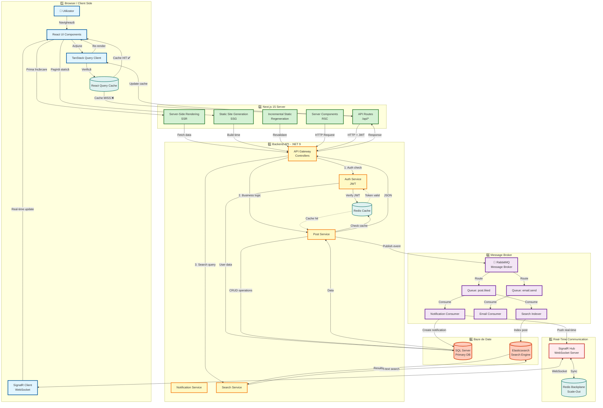

# Arhitectura Completă a Sistemului MindSpace

Această diagramă prezintă arhitectura completă end-to-end a platformei MindSpace, incluzând toate componentele și fluxurile de date.

## Diagrama Mermaid - Arhitectură Completă



## Diferențe Față de Diagrama Ta

### ✅ **Ce ai făcut bine:**
1. 3 straturi separate (Browser, Next.js, Backend)
2. React Query Cache mechanism
3. SSR/SSG/ISR componente
4. API Gateway centralizat
5. Redis Cache și dual database (SQL + Elasticsearch)

### ⚠️ **Ce am corectat:**

#### 1. **Server Components → Database**
❌ **Greșit în diagrama ta**: Server Components → Direct SQL  
✅ **Corect acum**: Server Components → API Gateway → SQL  

**De ce?** Separarea frontend de backend. Next.js server nu accesează direct baza de date.

#### 2. **Lipsea RabbitMQ**
🆕 **Adăugat**: RabbitMQ cu Queues și Consumers  
- Post liked → Queue → Notification Consumer → SQL + SignalR
- Email send → Queue → Email Consumer
- Search indexing → Queue → Indexer → Elasticsearch

#### 3. **Lipsea SignalR**
🆕 **Adăugat**: SignalR Hub cu Redis Backplane  
- Real-time notifications
- WebSocket connection
- Multi-server sync cu Redis

#### 4. **Cache Strategy mai detaliată**
- React Query Cache (client-side)
- Redis Cache (backend)
- Redis Backplane (SignalR scale-out)

## 🎯 Fluxuri Principale

### 📖 **1. Citire Post (SSR)**
```
User → React UI → SSR → Gateway → Redis Cache → (miss) → SQL → Response
```

### ✍️ **2. Creare Post (CSR + Async)**
```
User → React UI → TanStack → API Routes → Gateway → Post Service → SQL
                                                    ↓
                                                RabbitMQ → Search Indexer → Elasticsearch
```

### ❤️ **3. Like Post (Optimistic + Real-time)**
```
User → React UI (optimistic) → API Routes → Gateway → Post Service → SQL
                                                                      ↓
                                                                  RabbitMQ
                                                                      ↓
                                                            Notification Consumer
                                                                   ↓     ↓
                                                                 SQL   SignalR
                                                                         ↓
                                                                   Post Author
```

### 🔍 **4. Căutare (Full-Text)**
```
User → React UI → TanStack → API Routes → Gateway → Search Service → Elasticsearch
```

### 🔔 **5. Notificare Real-Time**
```
Action → RabbitMQ → Consumer → SignalR Hub → Redis Backplane → All Servers
                                                                      ↓
                                                            SignalR Client (WebSocket)
                                                                      ↓
                                                                  React UI
```

## 🚀 Componente Cheie

| Componentă | Rol | Tehnologie |
|------------|-----|------------|
| **React UI** | Interfață utilizator | React 19, TypeScript |
| **TanStack Query** | State management | React Query v5 |
| **Next.js 15** | SSR/SSG/ISR | App Router, Server Components |
| **API Gateway** | Rutare cereri | ASP.NET Core 9 Controllers |
| **Redis Cache** | Caching distribuit | StackExchange.Redis |
| **SQL Server** | Date persistente | Entity Framework Core 9 |
| **Elasticsearch** | Căutare full-text | Elastic.Clients.Elasticsearch |
| **RabbitMQ** | Message broker | MassTransit |
| **SignalR** | Real-time | SignalR + Redis Backplane |

## 📊 Avantaje Arhitectură

✅ **Performanță**: Multi-level caching (React Query + Redis)  
✅ **Scalabilitate**: Message queues + Load balancing  
✅ **Reziliență**: Async processing + Retry patterns  
✅ **SEO**: SSR pentru conținut dinamic  
✅ **UX**: Optimistic updates + Real-time notifications  
✅ **Separarea responsabilităților**: Clean Architecture  

## 🔐 Securitate

- JWT Authentication cu refresh tokens
- Token blacklist în Redis
- Rate limiting pe API Gateway
- CORS policies
- Input validation pe toate layerele

## 📈 Scalabilitate

- **Horizontal scaling**: Multiple API servers cu load balancer
- **Database scaling**: Read replicas pentru SQL
- **Cache scaling**: Redis cluster
- **Message scaling**: RabbitMQ cluster
- **SignalR scaling**: Redis backplane pentru multiple servere
