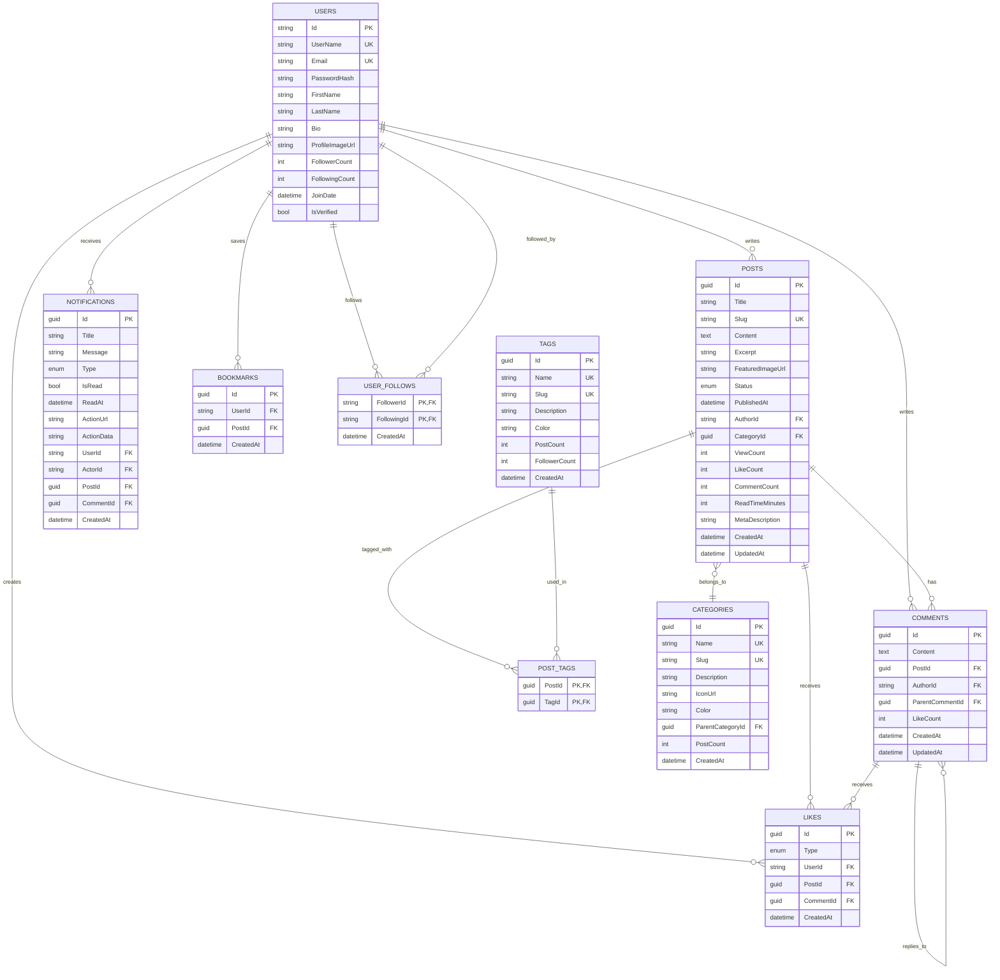

# Entity Relationship Diagram (ERD)

**Açıklama:**
- **PK**: Primary Key (Birincil Anahtar)
- **FK**: Foreign Key (Yabancı Anahtar)
- **UK**: Unique Key (Benzersiz Anahtar)
- **||--o{**: One-to-Many ilişki (1:N)
- **}o--||**: Many-to-One ilişki (N:1)
- **||--||**: One-to-One ilişki (1:1)
