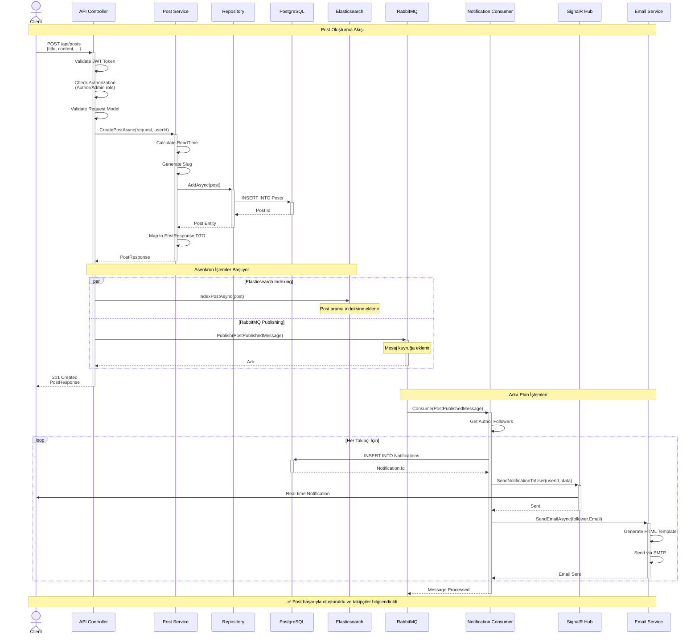

# Sequence Diagram - Post Oluşturma ve Bildirim Akışı

**Akış Açıklaması:**

1. **Senkron İşlemler** (Client bekler):
   - JWT token doğrulama
   - Authorization kontrolü
   - Model validation
   - Veritabanına kayıt
   - Response dönme

2. **Asenkron İşlemler** (Client beklemez):
   - Elasticsearch'e indeksleme
   - RabbitMQ'ya mesaj gönderme

3. **Arka Plan İşlemleri**:
   - Consumer mesajı alır
   - Her takipçi için bildirim oluşturur
   - SignalR ile real-time bildirim gönderir
   - Email gönderir
