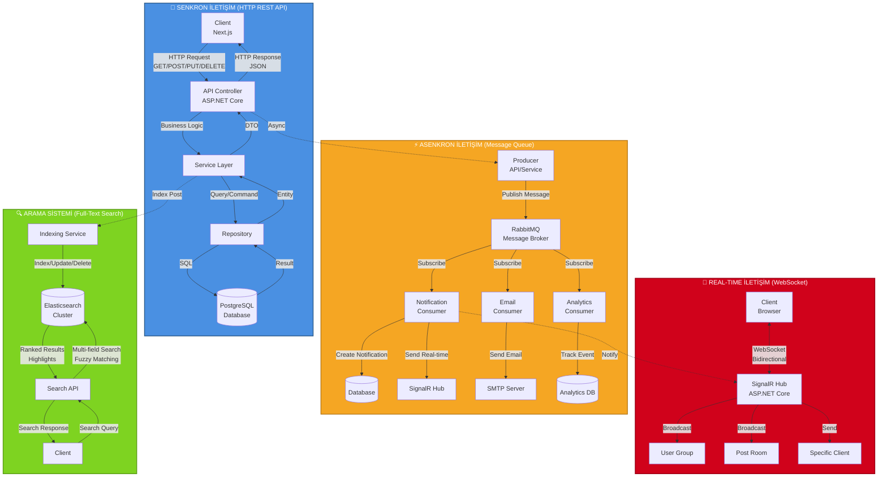

# Veri Akışı - Senkron, Asenkron ve Real-Time

**İletişim Modelleri:**

### 1. Senkron İletişim (HTTP REST API)
- **Kullanım**: CRUD işlemleri, veri sorgulama
- **Özellik**: Request-Response pattern, client bekler
- **Örnek**: Post listesi getirme, kullanıcı profili güncelleme

### 2. Asenkron İletişim (RabbitMQ)
- **Kullanım**: Uzun süren işlemler, bildirimler
- **Özellik**: Fire-and-forget, retry mekanizması
- **Örnek**: Email gönderme, bildirim oluşturma, analytics

### 3. Real-Time İletişim (SignalR)
- **Kullanım**: Anlık güncellemeler, canlı bildirimler
- **Özellik**: Bidirectional, push notifications
- **Örnek**: Yeni bildirim, yeni yorum, like counter

### 4. Arama Sistemi (Elasticsearch)
- **Kullanım**: Full-text search, filtreleme
- **Özellik**: Fuzzy matching, relevance scoring
- **Örnek**: Post arama, tag arama, yazar arama
