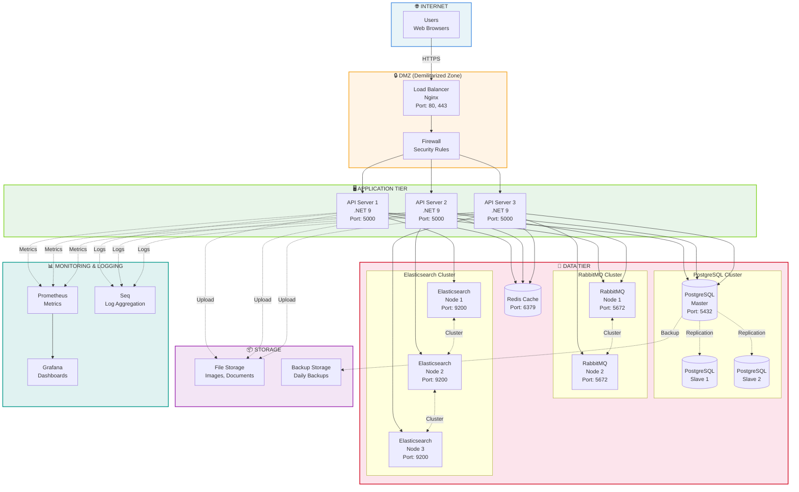

# Deployment Architecture - Production Environment



**Deployment Özellikleri:**

### 🔒 Security Layer
- **Load Balancer**: Nginx ile SSL termination, rate limiting
- **Firewall**: IP filtering, DDoS protection
- **HTTPS**: TLS 1.3, Let's Encrypt certificates

### 🖥️ Application Layer
- **3 API Servers**: Horizontal scaling, load balancing
- **Health Checks**: /health endpoint monitoring
- **Auto-scaling**: CPU/Memory based scaling

### 💾 Data Layer
- **PostgreSQL Cluster**: Master-Slave replication, automatic failover
- **RabbitMQ Cluster**: High availability, message persistence
- **Elasticsearch Cluster**: 3-node cluster, shard replication
- **Redis Cache**: In-memory caching, session storage

### 📦 Storage
- **File Storage**: CDN integration, image optimization
- **Backup**: Daily automated backups, 30-day retention

### 📊 Monitoring
- **Prometheus**: Metrics collection (CPU, memory, requests/sec)
- **Grafana**: Real-time dashboards, alerting
- **Seq**: Structured logging, log search

### 🔧 Infrastructure as Code
```yaml
# docker-compose.yml
version: '3.8'
services:
  nginx:
    image: nginx:alpine
    ports: ["80:80", "443:443"]
  
  api:
    image: mindspace-api:latest
    replicas: 3
    
  postgres:
    image: postgres:16
    
  rabbitmq:
    image: rabbitmq:3.12-management
    
  elasticsearch:
    image: elasticsearch:8.11.0
    
  redis:
    image: redis:7-alpine
```
