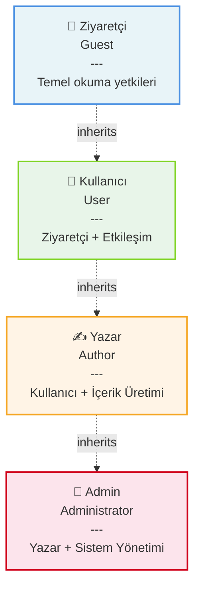

# Use Case Diagram - MindSpace Platform

```mermaid
graph TB
    subgraph System["MindSpace Platform"]
        subgraph GuestUC["👤 Ziyaretçi Use Cases"]
            UC1[Post'ları Görüntüle]
            UC2[Post Ara<br/>Elasticsearch]
            UC3[Kategori/Tag Filtrele]
            UC4[Yazar Profili Görüntüle]
            UC5[Kayıt Ol]
            UC6[Giriş Yap]
        end
        
        subgraph UserUC["👥 Kullanıcı Use Cases"]
            UC7[Post Beğen/Unlike]
            UC8[Yorum Yap]
            UC9[Yoruma Yanıt Ver<br/>Nested Comments]
            UC10[Yorumu Beğen]
            UC11[Post Kaydet<br/>Bookmark]
            UC12[Yazar Takip Et]
            UC13[Tag Takip Et]
            UC14[Bildirimleri Görüntüle<br/>Real-time]
            UC15[Profil Düzenle]
            UC16[Çıkış Yap]
        end
        
        subgraph AuthorUC["✍️ Yazar Use Cases"]
            UC17[Post Oluştur<br/>Draft]
            UC18[Post Düzenle]
            UC19[Post Yayınla<br/>Draft → Published]
            UC20[Post Arşivle]
            UC21[Post Sil]
            UC22[Post İstatistikleri<br/>Views, Likes, Comments]
            UC23[Yorumları Yönet]
        end
        
        subgraph AdminUC["👑 Admin Use Cases"]
            UC24[Tüm Post'ları Yönet]
            UC25[Kullanıcıları Yönet]
            UC26[Kategorileri Yönet<br/>CRUD]
            UC27[Tag'leri Yönet<br/>CRUD]
            UC28[Yorumları Modere Et]
            UC29[Kullanıcı Rollerini<br/>Değiştir]
            UC30[Sistem İstatistikleri]
        end
    end
    
    %% Actors
    Guest[👤 Ziyaretçi<br/>Guest]
    User[👥 Kullanıcı<br/>User]
    Author[✍️ Yazar<br/>Author]
    Admin[👑 Admin<br/>Administrator]
    
    %% Guest connections
    Guest --> UC1
    Guest --> UC2
    Guest --> UC3
    Guest --> UC4
    Guest --> UC5
    Guest --> UC6
    
    %% User connections (includes Guest)
    User --> UC1
    User --> UC2
    User --> UC3
    User --> UC4
    User --> UC7
    User --> UC8
    User --> UC9
    User --> UC10
    User --> UC11
    User --> UC12
    User --> UC13
    User --> UC14
    User --> UC15
    User --> UC16
    
    %% Author connections (includes User)
    Author --> UC1
    Author --> UC2
    Author --> UC7
    Author --> UC8
    Author --> UC14
    Author --> UC15
    Author --> UC17
    Author --> UC18
    Author --> UC19
    Author --> UC20
    Author --> UC21
    Author --> UC22
    Author --> UC23
    
    %% Admin connections (includes Author)
    Admin --> UC1
    Admin --> UC7
    Admin --> UC14
    Admin --> UC17
    Admin --> UC18
    Admin --> UC19
    Admin --> UC22
    Admin --> UC24
    Admin --> UC25
    Admin --> UC26
    Admin --> UC27
    Admin --> UC28
    Admin --> UC29
    Admin --> UC30
    
    %% Styling
    classDef guestStyle fill:#E8F4F8,stroke:#4A90E2,stroke-width:2px
    classDef userStyle fill:#E8F5E9,stroke:#7ED321,stroke-width:2px
    classDef authorStyle fill:#FFF4E6,stroke:#F5A623,stroke-width:2px
    classDef adminStyle fill:#FCE4EC,stroke:#D0021B,stroke-width:2px
    
    class GuestUC guestStyle
    class UserUC userStyle
    class AuthorUC authorStyle
    class AdminUC adminStyle
```

**Aktör Hiyerarşisi:**

**Rol Açıklamaları:**

### 👤 Ziyaretçi (Guest)
- Kayıtsız kullanıcı
- Sadece okuma yetkileri
- Post görüntüleme, arama, filtreleme

### 👥 Kullanıcı (User)
- Kayıtlı kullanıcı
- Ziyaretçi + Etkileşim yetkileri
- Beğeni, yorum, takip, bookmark

### ✍️ Yazar (Author)
- İçerik üreticisi
- Kullanıcı + İçerik yönetimi
- Post oluşturma, düzenleme, yayınlama

### 👑 Admin (Administrator)
- Sistem yöneticisi
- Yazar + Tüm yetkiler
- Kullanıcı, kategori, tag yönetimi
