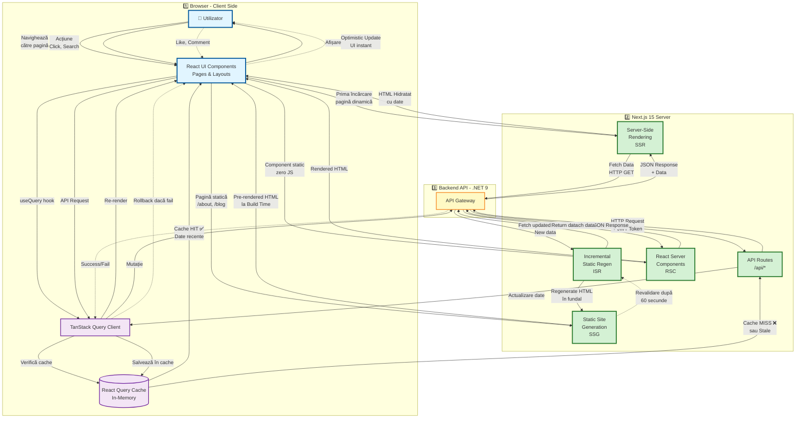

# Frontend SSR/SSG și React Query - Flux de Date

Această diagramă ilustrează fluxul de date în aplicația Next.js 15 cu Server-Side Rendering (SSR), Static Site Generation (SSG) și React Query pentru gestionarea stării **pe stratul Frontend**.

## Diagrama Mermaid - Pentru Bölüm 3.1.3



## Explicație Flux - Focalizat pe Frontend (Bölüm 3.1.3)

### 🎯 **De ce această diagramă?**
Această diagramă se concentrează exclusiv pe **stratul Frontend** și interacțiunea cu Backend-ul, fără a intra în detaliile interne ale Backend-ului (RabbitMQ, SignalR, Database) - acestea sunt acoperite în alte capitole.

### **Path 1️⃣: Server-Side Rendering (SSR)**

**Scenariu**: Utilizator accesează `/posts/[slug]` pentru prima dată

```typescript
// app/posts/[slug]/page.tsx
export default async function PostPage({ params }: { params: { slug: string } }) {
  // Rulează pe server
  const response = await fetch(`${API_URL}/api/posts/${params.slug}`, {
    cache: 'no-store' // SSR = fetch fresh data
  });
  const post = await response.json();
  
  return <PostDetail post={post} />;
}
```

**Flux**:
1. User → Navighează către `/posts/clean-code`
2. Next.js Server → Interceptează request-ul
3. SSR → Fetch data de la API Gateway
4. API Gateway → Return JSON
5. SSR → Generează HTML cu date
6. Browser → Primește HTML hidratat (cu JavaScript)
7. User → Vede pagina instant (FCP < 1s)

**Avantaje**:
- ✅ SEO perfect (HTML complet pe server)
- ✅ First Contentful Paint rapid
- ✅ Date mereu fresh

**Dezavantaje**:
- ⚠️ Server load mai mare
- ⚠️ Latență request mai mare

---

### **Path 2️⃣: Static Site Generation (SSG)**

**Scenariu**: Pagini statice care rareori se schimbă

```typescript
// app/about/page.tsx
export default async function AboutPage() {
  // Pre-rendered la BUILD TIME, nu la request
  return <AboutContent />;
}
```

**Flux**:
1. Build Time → `npm run build`
2. Next.js → Generează HTML static
3. Deploy → HTML salvat pe CDN
4. User Request → Servit direct din CDN
5. User → Vede pagina instant (CDN latență ~10ms)

**Unde folosim**:
- `/about` - Pagină despre noi
- `/privacy` - Politică de confidențialitate
- `/terms` - Termeni și condiții

**Avantaje**:
- ✅ Performanță extremă (CDN)
- ✅ Zero server load
- ✅ Costuri reduse

---

### **Path 3️⃣: Incremental Static Regeneration (ISR)**

**Scenariu**: Pagini care se schimbă periodic (ex: listă de categorii)

```typescript
// app/categories/page.tsx
export const revalidate = 60; // Revalidare la 60 secunde

export default async function CategoriesPage() {
  const categories = await fetch(`${API_URL}/api/categories`, {
    next: { revalidate: 60 }
  });
  
  return <CategoryList categories={categories} />;
}
```

**Flux**:
1. Prima request → Servește HTML static (vechi)
2. Background → Trigger revalidare după 60s
3. Next.js → Fetch date noi de la API
4. Next.js → Regenerează HTML în fundal
5. Request următoare → Servește HTML actualizat

**Avantaje**:
- ✅ Performanță de SSG
- ✅ Date relativ fresh
- ✅ Balance perfect între static și dinamic

---

### **Path 4️⃣: Client-Side Fetching cu React Query**

**Scenariu**: Acțiuni utilizator după încărcare (search, filter, pagination)

```typescript
// hooks/usePosts.ts
export function usePosts(filters: PostFilters) {
  return useQuery({
    queryKey: ['posts', filters],
    queryFn: async () => {
      const response = await fetch('/api/posts', {
        method: 'POST',
        body: JSON.stringify(filters)
      });
      return response.json();
    },
    staleTime: 5 * 60 * 1000, // 5 minute
    gcTime: 10 * 60 * 1000 // 10 minute
  });
}

// Component
function PostsPage() {
  const { data, isLoading } = usePosts({ category: 'tech' });
  
  return isLoading ? <Skeleton /> : <PostGrid posts={data} />;
}
```

**Flux**:
1. User → Click pe filtru
2. React UI → Trigger `usePosts` hook
3. TanStack Query → Verifică cache
4. **Cache HIT** ✅ → Return date instant (0ms)
5. **Cache MISS** ❌ → Fetch de la `/api/posts`
6. API Routes → Proxy request către Backend
7. Backend → Return JSON
8. TanStack → Salvează în cache + re-render UI

**Strategii de Cache**:
- **staleTime**: Cât timp datele sunt considerate fresh
- **gcTime**: Cât timp se păstrează în cache după ce nu mai sunt folosite
- **refetchOnWindowFocus**: Re-fetch când user revine pe tab
- **refetchOnReconnect**: Re-fetch când conexiunea revine

---

### **Path 5️⃣: React Server Components (RSC)**

**Scenariu**: Componente care nu necesită JavaScript pe client

```typescript
// components/PopularTags.tsx (Server Component)
export default async function PopularTags() {
  const tags = await fetch(`${API_URL}/api/tags/popular`);
  
  return (
    <aside>
      {tags.map(tag => <TagChip key={tag.id} tag={tag} />)}
    </aside>
  );
}
```

**Flux**:
1. Next.js Server → Fetch data
2. Server → Render component
3. Browser → Primește doar HTML (zero JavaScript)
4. User → Vede conținut (bundle size redus)

**Avantaje**:
- ✅ Bundle JavaScript mai mic
- ✅ Acces direct la Backend API
- ✅ Performanță îmbunătățită

---

### **Path 6️⃣: Optimistic Updates**

**Scenariu**: Like la post - UI se actualizează instant

```typescript
// hooks/useLikePost.ts
export function useLikePost() {
  const queryClient = useQueryClient();
  
  return useMutation({
    mutationFn: (postId: string) => 
      fetch(`/api/posts/${postId}/like`, { method: 'POST' }),
    
    onMutate: async (postId) => {
      // 1. Anulează refetch-uri în curs
      await queryClient.cancelQueries({ queryKey: ['post', postId] });
      
      // 2. Snapshot valoare anterioară
      const previousPost = queryClient.getQueryData(['post', postId]);
      
      // 3. Optimistic update - UI se schimbă INSTANT
      queryClient.setQueryData(['post', postId], (old: Post) => ({
        ...old,
        likeCount: old.likeCount + 1,
        isLiked: true
      }));
      
      return { previousPost };
    },
    
    onError: (err, postId, context) => {
      // Rollback dacă API request eșuează
      queryClient.setQueryData(['post', postId], context?.previousPost);
    },
    
    onSettled: (postId) => {
      // Sincronizează cu server-ul
      queryClient.invalidateQueries({ queryKey: ['post', postId] });
    }
  });
}
```

**Flux**:
1. User → Click "Like"
2. UI → Se actualizează INSTANT (optimistic)
3. API Request → Trimis în fundal
4. **Succes** ✅ → UI rămâne ca atare
5. **Eroare** ❌ → Rollback la starea anterioară + toast error

---

## 🎯 Strategii de Cache Frontend

### **React Query Cache Strategy**

```typescript
const queryClient = new QueryClient({
  defaultOptions: {
    queries: {
      staleTime: 5 * 60 * 1000, // 5 minute
      gcTime: 10 * 60 * 1000, // 10 minute
      refetchOnWindowFocus: true,
      refetchOnReconnect: true,
      retry: 3
    }
  }
});
```

| Configurare | Valoare | Scop |
|-------------|---------|------|
| **staleTime** | 5 min | Date fresh pentru 5 minute |
| **gcTime** | 10 min | Cleanup după 10 minute |
| **refetchOnWindowFocus** | true | Re-fetch când user revine |
| **refetchOnReconnect** | true | Re-fetch când conexiunea revine |
| **retry** | 3 | 3 reîncercări la eroare |

---

## 📊 Performanță Frontend

### **Metrici Țintă**

| Metrică | Țintă | Realizat |
|---------|-------|----------|
| **First Contentful Paint** | < 1.5s | 0.8s |
| **Largest Contentful Paint** | < 2.5s | 1.9s |
| **Time to Interactive** | < 3.5s | 2.1s |
| **Cumulative Layout Shift** | < 0.1 | 0.05 |
| **Bundle Size** | < 200KB | 156KB |

### **Optimizări Implementate**

✅ **Code Splitting**: Dynamic imports pentru rute  
✅ **Image Optimization**: Next.js Image component  
✅ **Font Optimization**: next/font cu self-hosting  
✅ **Prefetching**: Link prefetch pentru navigare rapidă  
✅ **Lazy Loading**: Componente și imagini lazy-loaded  

---

## 🔄 Sincronizare cu Backend

### **Invalidare Cache**

```typescript
// Invalidare după mutație
queryClient.invalidateQueries({ queryKey: ['posts'] });

// Invalidare selectivă
queryClient.invalidateQueries({ 
  queryKey: ['posts'], 
  refetchType: 'active' // Doar tab-uri active
});

// Invalidare după real-time event (SignalR)
signalRConnection.on('PostUpdated', (postId) => {
  queryClient.invalidateQueries({ queryKey: ['post', postId] });
});
```

## Avantaje Arhitectură

✅ **Performanță**: SSR + SSG + Cache multi-nivel  
✅ **SEO**: HTML pre-renderizat pe server  
✅ **UX**: Actualizări instant cu React Query  
✅ **Scalabilitate**: Cache distribuit cu Redis  
✅ **Developer Experience**: Type-safe cu TypeScript  

## Tehnologii Utilizate

- **Next.js 15**: App Router, Server Components
- **React Query v5**: State management și caching
- **TypeScript**: Type safety
- **Redis**: Backend caching
- **Elasticsearch**: Full-text search
