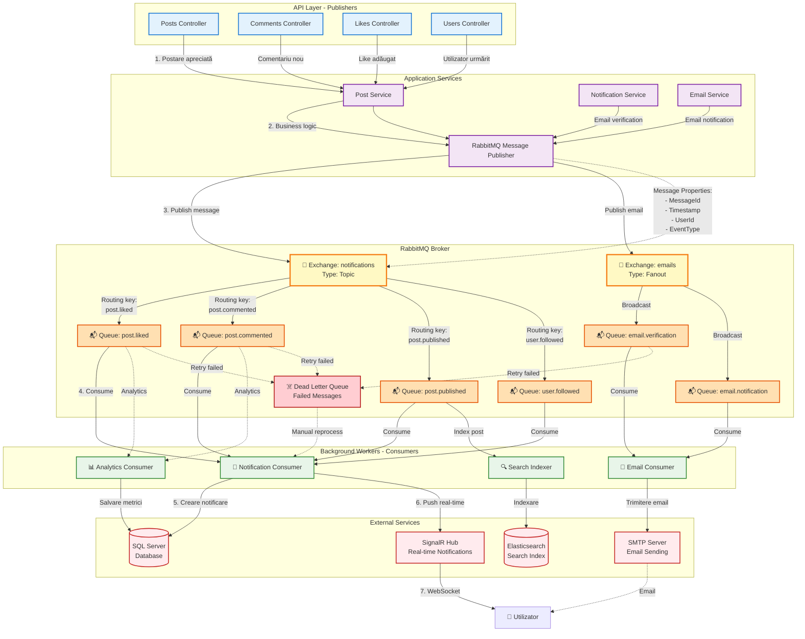

# RabbitMQ Publish/Subscribe și Consumer - Flux de Date

Această diagramă ilustrează arhitectura de mesagerie asincronă cu RabbitMQ, pattern-ul Publish/Subscribe și procesarea mesajelor prin consumatori în fundal.

## Diagrama Mermaid



## Explicație Arhitectură

### 1. **Publishers (Producători)**
```csharp
// Exemplu: Publicare mesaj când o postare este apreciată
await _messagePublisher.PublishNotificationAsync(new PostLikedMessage
{
    PostId = postId,
    PostTitle = post.Title,
    PostAuthorId = post.AuthorId,
    LikerUserId = currentUserId,
    LikerUserName = currentUser.UserName
});
```

### 2. **RabbitMQ Exchanges**

#### **Topic Exchange (notifications)**
- Routing flexibil bazat pe routing keys
- Pattern matching: `post.*`, `user.*`, `comment.*`
- Mesaje rutate către cozi specifice

#### **Fanout Exchange (emails)**
- Broadcast către toate cozile conectate
- Fără routing keys
- Ideal pentru notificări email

### 3. **Message Queues**
- **Durabilitate**: Mesajele persistă în caz de restart
- **Acknowledgment**: Manual ACK după procesare cu succes
- **Prefetch**: Limită de mesaje procesate simultan
- **TTL**: Time-to-live pentru mesaje vechi

### 4. **Consumers (Consumatori)**

#### **Notification Consumer**
```csharp
public async Task HandlePostLikedAsync(PostLikedMessage message)
{
    // 1. Salvează notificarea în DB
    await _notificationService.CreateNotificationAsync(...);
    
    // 2. Trimite prin SignalR în timp real
    await _hubService.SendNotificationAsync(...);
}
```

#### **Email Consumer**
```csharp
public async Task HandleEmailAsync(EmailNotificationMessage message)
{
    // Procesare în batch pentru eficiență
    await _emailService.SendEmailAsync(message);
}
```

### 5. **Dead Letter Queue (DLQ)**
- Mesaje care au eșuat după multiple reîncercări
- Monitorizare și alertare
- Reprocesare manuală sau automată

## Pattern-uri Implementate

### ✅ **Publish/Subscribe**
- Decuplare între producători și consumatori
- Un mesaj poate fi procesat de multiple consumatori
- Scalabilitate orizontală

### ✅ **Competing Consumers**
- Multiple instanțe de consumatori pentru aceeași coadă
- Load balancing automat
- Procesare paralelă

### ✅ **Retry Pattern**
- Reîncercări automate cu exponential backoff
- Dead letter queue pentru mesaje eșuate
- Circuit breaker pentru servicii externe

### ✅ **Idempotency**
- Mesajele pot fi procesate de multiple ori fără efecte secundare
- MessageId unic pentru deduplicare
- Verificare în DB înainte de procesare

## Avantaje Arhitectură

✅ **Asincronicitate**: Procesare în fundal fără blocare  
✅ **Scalabilitate**: Adăugare ușoară de consumatori  
✅ **Reziliență**: Retry automat și DLQ  
✅ **Decuplare**: Servicii independente  
✅ **Performanță**: Procesare paralelă  

## Configurare RabbitMQ

```json
{
  "RabbitMQ": {
    "Host": "localhost",
    "Port": 5672,
    "Username": "guest",
    "Password": "guest",
    "VirtualHost": "/",
    "Exchanges": {
      "Notifications": {
        "Name": "notifications",
        "Type": "topic",
        "Durable": true
      },
      "Emails": {
        "Name": "emails",
        "Type": "fanout",
        "Durable": true
      }
    }
  }
}
```

## Monitorizare

- **RabbitMQ Management UI**: http://localhost:15672
- **Metrici**: Message rate, consumer utilization, queue depth
- **Alerting**: Queue size thresholds, consumer failures
