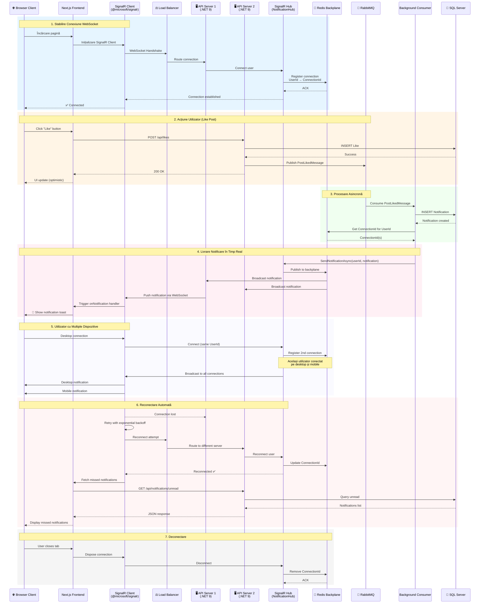

# SignalR WebSocket - Comunicare Bidirecțională în Timp Real

Această diagramă ilustrează arhitectura SignalR pentru comunicare în timp real între server și clienți, folosind WebSocket protocol pentru notificări instant.

## Diagrama Mermaid



## Explicație Arhitectură

### 1. **SignalR Hub (Server-Side)**

```csharp
[Authorize]
public class NotificationHub : Hub
{
    private readonly INotificationService _notificationService;
    
    public override async Task OnConnectedAsync()
    {
        var userId = Context.User?.FindFirst(ClaimTypes.NameIdentifier)?.Value;
        if (userId != null)
        {
            // Adaugă utilizatorul într-un grup
            await Groups.AddToGroupAsync(Context.ConnectionId, userId);
            
            // Trimite notificări nelivrate
            var unreadNotifications = await _notificationService
                .GetUnreadNotificationsAsync(userId);
            await Clients.Caller.SendAsync("ReceiveNotifications", unreadNotifications);
        }
        
        await base.OnConnectedAsync();
    }
    
    public async Task SendNotificationToUser(string userId, Notification notification)
    {
        await Clients.Group(userId).SendAsync("ReceiveNotification", notification);
    }
    
    public override async Task OnDisconnectedAsync(Exception? exception)
    {
        var userId = Context.User?.FindFirst(ClaimTypes.NameIdentifier)?.Value;
        if (userId != null)
        {
            await Groups.RemoveFromGroupAsync(Context.ConnectionId, userId);
        }
        
        await base.OnDisconnectedAsync(exception);
    }
}
```

### 2. **SignalR Client (Frontend - Next.js)**

```typescript
// lib/signalr-connection.ts
import * as signalR from '@microsoft/signalr';

export class NotificationConnection {
  private connection: signalR.HubConnection;
  
  constructor(accessToken: string) {
    this.connection = new signalR.HubConnectionBuilder()
      .withUrl('https://api.mindspace.com/hubs/notifications', {
        accessTokenFactory: () => accessToken,
        transport: signalR.HttpTransportType.WebSockets,
        skipNegotiation: true
      })
      .withAutomaticReconnect({
        nextRetryDelayInMilliseconds: (retryContext) => {
          // Exponential backoff: 0s, 2s, 10s, 30s
          if (retryContext.previousRetryCount === 0) return 0;
          if (retryContext.previousRetryCount === 1) return 2000;
          if (retryContext.previousRetryCount === 2) return 10000;
          return 30000;
        }
      })
      .configureLogging(signalR.LogLevel.Information)
      .build();
    
    this.setupHandlers();
  }
  
  private setupHandlers() {
    this.connection.on('ReceiveNotification', (notification) => {
      // Afișează toast notification
      toast.info(notification.message, {
        action: {
          label: 'Vezi',
          onClick: () => router.push(notification.actionUrl)
        }
      });
      
      // Actualizează badge count
      queryClient.invalidateQueries(['notifications', 'unread-count']);
    });
    
    this.connection.onreconnecting((error) => {
      console.log('Reconnecting...', error);
      toast.warning('Reconectare la server...');
    });
    
    this.connection.onreconnected((connectionId) => {
      console.log('Reconnected:', connectionId);
      toast.success('Reconectat cu succes!');
    });
    
    this.connection.onclose((error) => {
      console.error('Connection closed:', error);
      toast.error('Conexiune pierdută. Reîncercăm...');
    });
  }
  
  async start() {
    try {
      await this.connection.start();
      console.log('SignalR Connected');
    } catch (err) {
      console.error('SignalR Connection Error:', err);
      setTimeout(() => this.start(), 5000);
    }
  }
  
  async stop() {
    await this.connection.stop();
  }
}
```

### 3. **React Hook pentru SignalR**

```typescript
// hooks/useNotifications.ts
export function useNotifications() {
  const { data: session } = useSession();
  const [connection, setConnection] = useState<NotificationConnection | null>(null);
  
  useEffect(() => {
    if (session?.accessToken) {
      const notificationConnection = new NotificationConnection(session.accessToken);
      notificationConnection.start();
      setConnection(notificationConnection);
      
      return () => {
        notificationConnection.stop();
      };
    }
  }, [session?.accessToken]);
  
  return { connection };
}
```

### 4. **Redis Backplane pentru Scale-Out**

```csharp
// Program.cs
builder.Services.AddSignalR()
    .AddStackExchangeRedis(options =>
    {
        options.Configuration.EndPoints.Add("localhost:6379");
        options.Configuration.ChannelPrefix = "MindSpace.SignalR";
    });
```

**De ce Redis Backplane?**
- Multiple instanțe de server pot comunica între ele
- Mesajele sunt broadcast către toate serverele
- Utilizatorii pot fi conectați la servere diferite
- Scalabilitate orizontală

## Scenarii de Utilizare

### 📬 **Notificări în Timp Real**
- Like-uri la postări
- Comentarii noi
- Urmăritori noi
- Mențiuni în comentarii

### 💬 **Chat în Timp Real** (viitor)
- Mesaje directe între utilizatori
- Typing indicators
- Read receipts

### 📊 **Actualizări Live**
- Număr de vizualizări în timp real
- Trending posts
- Online users count

## Avantaje SignalR

✅ **WebSocket Native**: Comunicare full-duplex  
✅ **Fallback Automat**: Long polling dacă WebSocket nu e disponibil  
✅ **Reconnect Automat**: Exponential backoff  
✅ **Scale-Out**: Redis backplane pentru multiple servere  
✅ **Type-Safe**: TypeScript pe client, C# pe server  
✅ **Authentication**: JWT token integration  

## Performanță

- **Latență**: < 50ms pentru notificări
- **Throughput**: 10,000+ conexiuni concurente per server
- **Bandwidth**: ~1KB per notificare
- **Reconnect Time**: 0-30s cu exponential backoff

## Monitorizare

```csharp
// Metrici SignalR
- Conexiuni active
- Mesaje trimise/secundă
- Erori de conexiune
- Timp mediu de livrare
```
